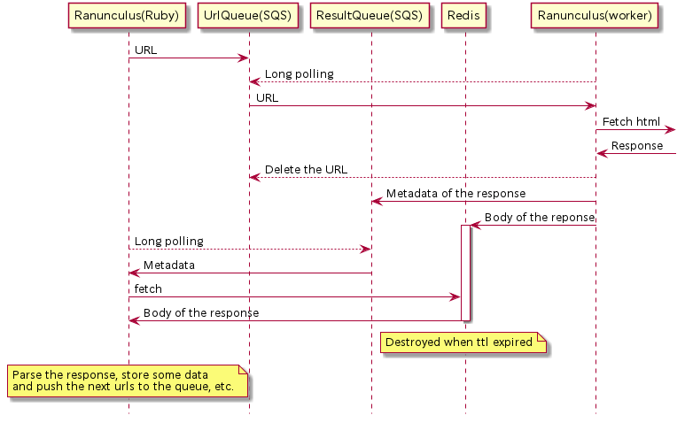

# Ranunculus

Ranunculus is a PoC of a web crawler worker depending on Amazon SQS and ElastiCache(Redis) written in Go.

If you search for a flexible web crawler written in Go,
you should take a look at [fetchbot](https://github.com/PuerkitoBio/fetchbot) instead.
(I starred it)

# Install

Just execute 

    $ go get github.com/k-kawa/ranunculus

# Architecture

This works with ...

- two SQSs, one(URL Queue) is to give the crawler urls to fetch and the other(ResultQueue) is to push its results,
- a Redis server which cache the HTML
- and the [Ruby Gem](https://rubygems.org/gems/ranunculus) (whose name is the same, Ranunculus) which controls the whole process.

